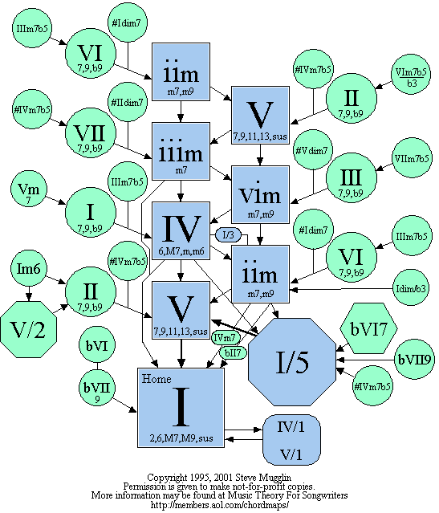

# Chord Chain Analysis

I aim to use the user-contributed chord progressions on [Ultimate
Guitar](https://ultimate-guitar.com) to construct a database of popular chord
progressions. Such a dataset could power a number of different tools.

## Progression Builder

Given a series of chords, a model could recommend or predict the next chord. By
combining this with existing tools which detect chords from audio samples, this
could be built into an interactive composition companion. The easiest way to
build this is around a Markov model.

## Chord Visualization

Stephen Mugglin has produced a chart which visualizes connections between major
chords. This version of the chart uses scale degrees, making it key-ambivalent.
I've found it a useful tool for learning musical composition on piano.

## Markov Model

## Tools

I can use `tmux` to run terminal processes in the background. `tmux detach` or
`C-b C-d` gets me out of the tmux session, after which I can `tmux attach` or
`tmux capture-pane -pS 8` to check on its progress. System resources are, as
usual, easily monitored with `btop`.

`networkx` is a Python library for creating and analyzing graphs, helpful for
building quick visualizations of graph data.
